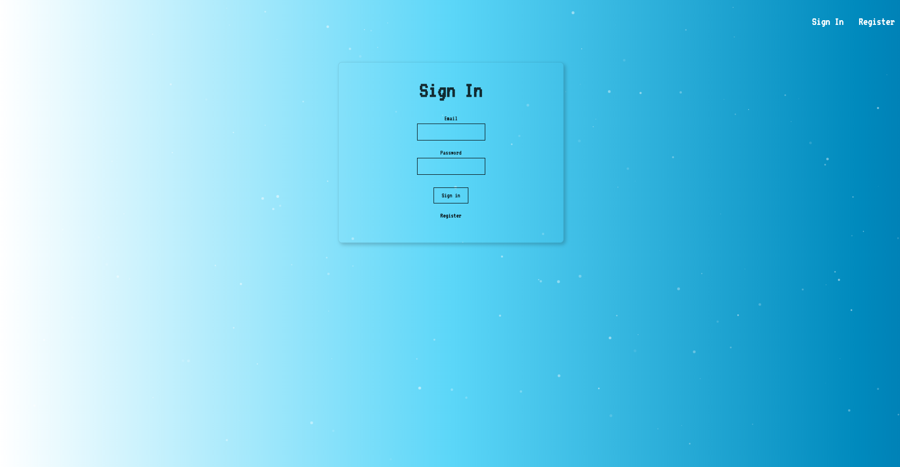
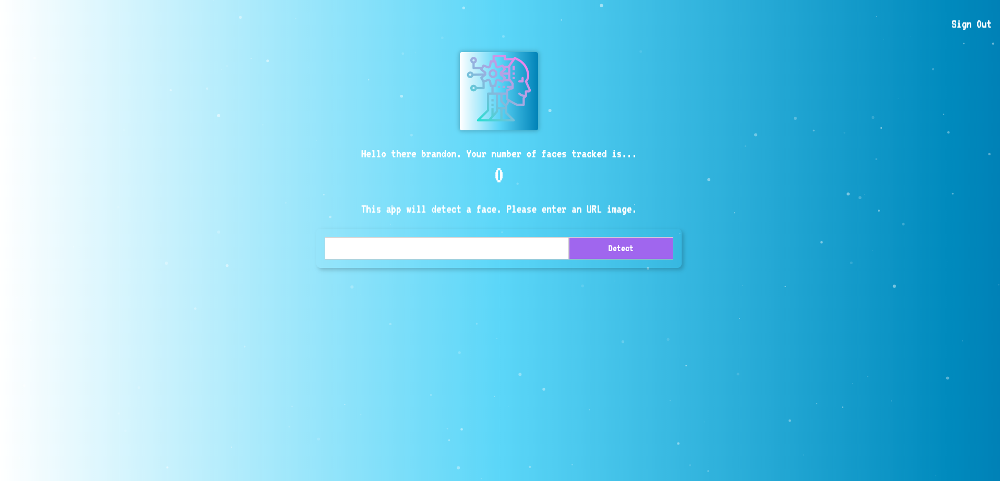

## Links
Main Link: [https://facerecognitionapp101.herokuapp.com/] 
Backend API: [https://facialrecognitionbackend.herokuapp.com/] 
Backend Github: [https://github.com/brandonmcastillo/facialrecognitionbackend]

## Screenshots

 

## Technologies

The technologies I used for this application for the front end was React.js, tachyons for styling and Clarifai for the exteral API to track the faces. The backend uses Node.js/Express and PostgreSQL.

### Summary + What I learned + Challenges

This app was based on Andrei Neagoeis final project for his full stack bootcamp. It helped me get a more clear and concise way of using React even though I have built a react application before. I originally had trouble understanding state and passing props but this helped practice my skills and become more comfortable using react. In additon, I learned about tachyons, knex.js (SQL query builder), bcrypt-nodejs and other technologies that can help me in the future.  

Some challenges I ran into was mainly focused on pinpointing where to pass props since it is a one way binding dataflow and making sure to remember the state of certain components. 

